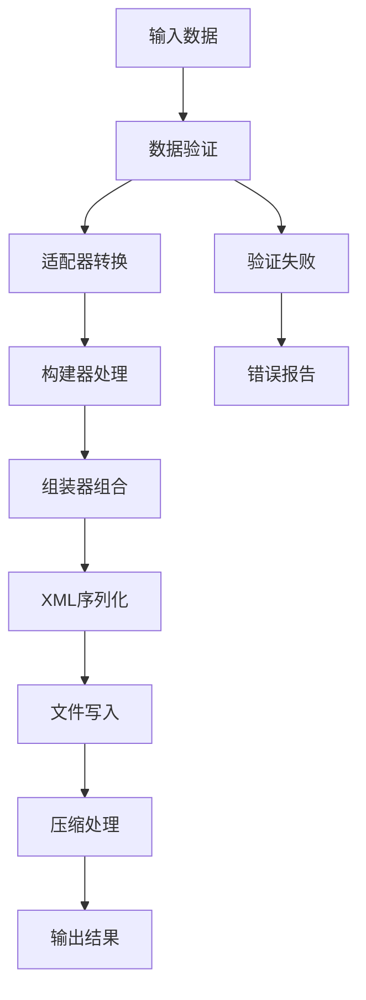
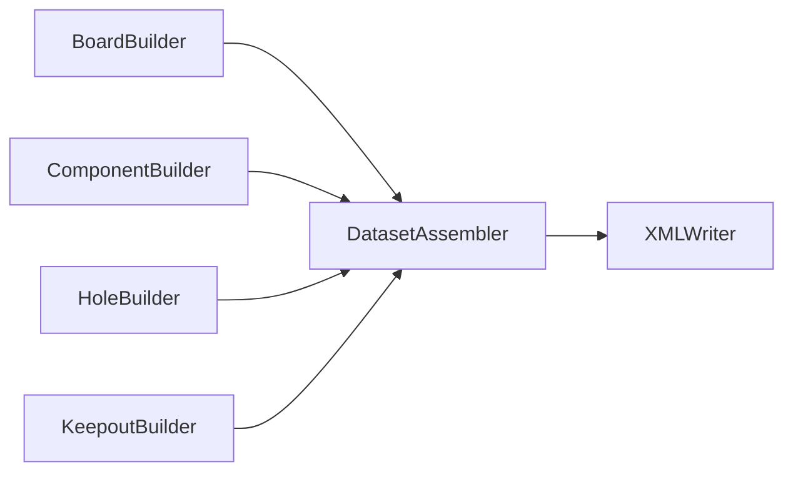
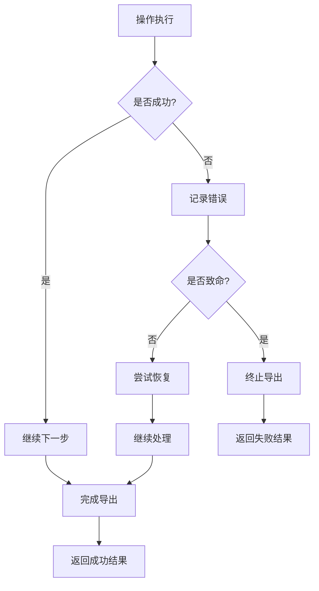

# IDX导出器 - 设计文档

## 1. 架构设计

### 1.1 整体架构

本项目采用**构建器模式 + 管道模式**的架构设计，数据流如下：

```
数据源 → 适配器 → 构建器 → 组装器 → 写入器 → 输出文件
(ECAD)  (Adapter)  (Builder) (Assembler) (Writer)  (.idx/.idz)
```

### 1.2 核心组件

| 组件 | 职责 | 关键技术 |
|------|------|----------|
| **适配器(Adapter)** | 数据源转换，统一接口 | 适配器模式，数据映射 |
| **构建器(Builder)** | 创建IDX对象树 | 构建器模式，类型转换 |
| **组装器(Assembler)** | 组织完整IDX结构 | 组合模式，验证 |
| **写入器(Writer)** | XML序列化与输出 | xmlbuilder2，流式写入 |
| **管理器(Exporter)** | 流程控制，配置管理 | 策略模式，状态管理 |

### 1.3 目录结构

```
src/
├── exporter/                    # 导出模块
│   ├── index.ts                # 主导出入口
│   ├── builders/               # 各类构建器
│   │   ├── base-builder.ts     # 构建器基类
│   │   ├── board-builder.ts    # PCB板构建
│   │   ├── component-builder.ts # 组件构建
│   │   ├── hole-builder.ts     # 孔构建
│   │   ├── keepout-builder.ts  # 保持区域构建
│   │   └── layer-builder.ts    # 层构建
│   ├── assemblers/             # 数据组装器
│   │   └── dataset-assembler.ts # 数据集组装
│   ├── writers/                # 写入器
│   │   ├── xml-writer.ts       # XML写入
│   │   └── compression-writer.ts # 压缩写入
│   └── adapters/               # 适配器
│       └── generic-adapter.ts  # 通用适配器
├── types/core/                 # 核心类型定义
│   ├── common.ts              # 通用类型
│   ├── enums.ts               # 枚举定义
│   ├── geometry.ts            # 几何类型
│   ├── items.ts               # 项目类型
│   └── messages.ts            # 消息类型
└── utils/                      # 工具函数
    ├── geometry-utils.ts       # 几何工具
    ├── validation-utils.ts     # 验证工具
    └── id-generator.ts         # ID生成器
```

## 2. 接口设计

### 2.1 主导出器接口

```typescript
export interface IDXExportConfig {
  output: {
    directory: string;
    designName: string;
    compress: boolean;
    namingPattern: string;
  };
  protocolVersion: '4.5';
  geometry: {
    useSimplified: boolean;
    defaultUnit: GlobalUnit;
    precision: number;
  };
  collaboration: {
    creatorSystem: string;
    creatorCompany: string;
    includeNonCollaborative: boolean;
    includeLayerStackup: boolean;
  };
}

export interface ExportResult {
  success: boolean;
  files: ExportedFile[];
  statistics: ExportStatistics;
  issues: ExportIssue[];
}

export class IDXExporter {
  constructor(config: Partial<IDXExportConfig>);
  async export(data: ExportSourceData): Promise<ExportResult>;
  createBaseline(boardData: BoardData): SendInformationMessage;
}
```

### 2.2 构建器接口

```typescript
export abstract class BaseBuilder<TInput, TOutput> {
  protected config: BuilderConfig;
  protected context: BuilderContext;
  
  async build(input: TInput): Promise<TOutput>;
  protected abstract validateInput(input: TInput): ValidationResult<TInput>;
  protected abstract preProcess(input: TInput): Promise<any>;
  protected abstract construct(processed: any): Promise<TOutput>;
  protected abstract postProcess(output: TOutput): Promise<TOutput>;
}

export interface BuilderContext {
  getNextSequence(type: string): number;
  generateId(type: string, identifier?: string): string;
  addWarning(code: string, message: string, itemId?: string): void;
  addError(code: string, message: string, itemId?: string): void;
}
```

### 2.3 数据模型接口

```typescript
export interface BoardData {
  id: string;
  name: string;
  outline: {
    points: Array<{ x: number; y: number }>;
    thickness: number;
    material?: string;
    finish?: string;
  };
  cutouts?: CutoutData[];
  stiffeners?: StiffenerData[];
  properties?: Record<string, any>;
}

export interface ComponentData {
  refDes: string;
  partNumber: string;
  packageName: string;
  position: {
    x: number;
    y: number;
    z: number;
    rotation: number;
  };
  dimensions: {
    width: number;
    height: number;
    thickness: number;
  };
  layer: string;
  isMechanical: boolean;
  electrical?: ElectricalProperties;
  thermal?: ThermalProperties;
  model3D?: Model3DReference;
}

export interface HoleData {
  id: string;
  type: 'mounting' | 'via' | 'component' | 'tooling';
  position: { x: number; y: number };
  shape: 'circle' | 'ellipse' | 'polygon';
  parameters: CircleParameters | EllipseParameters | PolygonParameters;
  plated: boolean;
  depth: number;
  properties?: Record<string, any>;
}

export interface KeepoutData {
  id: string;
  type: 'component' | 'route' | 'via' | 'testpoint' | 'thermal' | 'other';
  purpose: 'ComponentPlacement' | 'Route' | 'Via' | 'TestPoint' | 'Thermal' | 'Other';
  shape: ShapeData;
  layer: string;
  zRange?: { lower: number; upper: number };
  properties?: Record<string, any>;
}
```

### 2.4 几何工具接口

```typescript
export class GeometryUtils {
  constructor(config: GeometryConfig);
  
  roundValue(value: number): number;
  createBoundingBoxCurveSet(width: number, height: number, thickness: number, zOffset: number): EDMDCurveSet2D;
  createCircleCurveSet(diameter: number, thickness: number, zOffset: number): EDMDCurveSet2D;
  createPolygonCurveSet(points: Point2D[], thickness: number, zOffset: number): EDMDCurveSet2D;
  validatePolygon(points: Point2D[]): ValidationResult;
  calculateBoundingBox(points: Point2D[]): BoundingBox;
}
```

## 3. 核心算法设计

### 3.1 几何转换算法

#### 3.1.1 2D到2.5D转换
```typescript
/**
 * 将2D轮廓转换为IDX的2.5D几何表示
 */
function create2_5DGeometry(
  outline2D: Point2D[],
  zLower: number,
  zUpper: number
): EDMDCurveSet2D {
  // 1. 验证2D轮廓有效性
  validateOutline(outline2D);
  
  // 2. 创建多段线
  const polyLine = createPolyLine(outline2D);
  
  // 3. 创建曲线集合
  const curveSet: EDMDCurveSet2D = {
    id: generateId('CURVESET'),
    ShapeDescriptionType: 'GeometricModel',
    LowerBound: { Value: zLower },
    UpperBound: { Value: zUpper },
    DetailedGeometricModelElement: polyLine.id
  };
  
  return curveSet;
}
```

#### 3.1.2 坐标变换算法
```typescript
/**
 * 应用2D变换矩阵
 */
function applyTransformation(
  point: Point2D,
  transformation: Transformation2D
): Point2D {
  const { xx, xy, yx, yy, tx, ty } = transformation;
  
  return {
    x: xx * point.x + xy * point.y + tx,
    y: yx * point.x + yy * point.y + ty
  };
}
```

### 3.2 ID生成算法

```typescript
/**
 * 生成唯一的IDX项目ID
 */
class IDGenerator {
  private sequences: Map<string, number> = new Map();
  
  generateItemId(type: string, identifier?: string): string {
    const prefix = this.getTypePrefix(type);
    const seq = this.getNextSequence(type);
    
    if (identifier) {
      return `${prefix}_${identifier}_${seq.toString().padStart(3, '0')}`;
    }
    
    return `${prefix}_${Date.now()}_${seq.toString().padStart(3, '0')}`;
  }
  
  private getTypePrefix(type: string): string {
    const prefixMap = {
      'BOARD': 'BRD',
      'COMPONENT': 'CMP',
      'HOLE': 'HOLE',
      'KEEPOUT': 'KO',
      'SHAPE': 'SHP',
      'POINT': 'PT'
    };
    return prefixMap[type] || type;
  }
}
```

### 3.3 验证算法

```typescript
/**
 * 多边形有效性验证
 */
function validatePolygon(points: Point2D[]): ValidationResult {
  const errors: string[] = [];
  const warnings: string[] = [];
  
  // 检查点数量
  if (points.length < 3) {
    errors.push('多边形至少需要3个点');
  }
  
  // 检查闭合性
  const first = points[0];
  const last = points[points.length - 1];
  if (first.x !== last.x || first.y !== last.y) {
    warnings.push('多边形未闭合，将自动添加闭合点');
  }
  
  // 检查自相交
  if (hasSelfIntersection(points)) {
    warnings.push('检测到多边形自相交');
  }
  
  return {
    valid: errors.length === 0,
    errors,
    warnings
  };
}
```

## 4. 数据流设计

### 4.1 导出流程



### 4.2 构建器协作



### 4.3 错误处理流程



## 5. 性能优化设计

### 5.1 内存优化

```typescript
/**
 * 流式XML写入器，避免将整个XML文档加载到内存
 */
class StreamingXMLWriter {
  private stream: WriteStream;
  
  async writeHeader(header: EDMDHeader): Promise<void> {
    // 立即写入头部，不缓存
    await this.stream.write(this.serializeHeader(header));
  }
  
  async writeItem(item: EDMDItem): Promise<void> {
    // 逐个写入项目，处理完立即释放内存
    await this.stream.write(this.serializeItem(item));
  }
}
```

### 5.2 批处理优化

```typescript
/**
 * 批量处理组件以提高性能
 */
class ComponentBatchProcessor {
  private batchSize = 100;
  
  async processBatch(components: ComponentData[]): Promise<EDMDItem[]> {
    const results: EDMDItem[] = [];
    
    for (let i = 0; i < components.length; i += this.batchSize) {
      const batch = components.slice(i, i + this.batchSize);
      const batchResults = await Promise.all(
        batch.map(comp => this.componentBuilder.build(comp))
      );
      results.push(...batchResults);
    }
    
    return results;
  }
}
```

## 6. 安全性设计

### 6.1 输入验证

```typescript
/**
 * 输入数据清理和验证
 */
class InputSanitizer {
  sanitizeString(input: string): string {
    // 移除或转义XML特殊字符
    return input
      .replace(/&/g, '&amp;')
      .replace(/</g, '&lt;')
      .replace(/>/g, '&gt;')
      .replace(/"/g, '&quot;')
      .replace(/'/g, '&apos;');
  }
  
  validateNumericRange(value: number, min: number, max: number): boolean {
    return !isNaN(value) && value >= min && value <= max;
  }
}
```

### 6.2 文件路径安全

```typescript
/**
 * 安全的文件路径处理
 */
class SafePathHandler {
  validateOutputPath(path: string): boolean {
    // 防止路径遍历攻击
    const normalizedPath = path.normalize();
    return !normalizedPath.includes('..') && 
           !normalizedPath.startsWith('/') &&
           !normalizedPath.includes('\\');
  }
}
```

## 7. 可扩展性设计

### 7.1 插件架构

```typescript
/**
 * 构建器注册表，支持动态扩展
 */
class BuilderRegistry {
  private builders: Map<string, BaseBuilder<any, any>> = new Map();
  
  register<T, U>(type: string, builder: BaseBuilder<T, U>): void {
    this.builders.set(type, builder);
  }
  
  get<T, U>(type: string): BaseBuilder<T, U> | undefined {
    return this.builders.get(type) as BaseBuilder<T, U>;
  }
}
```

### 7.2 配置驱动

```typescript
/**
 * 配置驱动的导出行为
 */
interface ExportProfile {
  name: string;
  description: string;
  config: IDXExportConfig;
  customBuilders?: Record<string, string>; // 自定义构建器类名
}

class ProfileManager {
  private profiles: Map<string, ExportProfile> = new Map();
  
  loadProfile(name: string): ExportProfile | undefined {
    return this.profiles.get(name);
  }
  
  createExporter(profileName: string): IDXExporter {
    const profile = this.loadProfile(profileName);
    if (!profile) {
      throw new Error(`Profile not found: ${profileName}`);
    }
    
    return new IDXExporter(profile.config);
  }
}
```

## 8. Correctness Properties

### 8.1 结构正确性属性

**Property 1.1: XML结构完整性**
```typescript
/**
 * 验证生成的XML包含所有必需的根元素
 * @property 所有导出的IDX文件必须包含Header、Body和ProcessInstruction元素
 */
function validateXMLStructure(xml: string): boolean {
  const doc = parseXML(xml);
  const root = doc.documentElement;
  
  return root.tagName === 'foundation:EDMDDataSet' &&
         hasChild(root, 'foundation:Header') &&
         hasChild(root, 'foundation:Body') &&
         hasChild(root, 'foundation:ProcessInstruction');
}
```

**Property 1.2: ID唯一性**
```typescript
/**
 * 验证所有生成的ID在文档中是唯一的
 * @property 在同一个IDX文件中，所有元素的id属性值必须唯一
 */
function validateIDUniqueness(dataset: EDMDDataSet): boolean {
  const ids = new Set<string>();
  
  function collectIds(obj: any): void {
    if (obj && typeof obj === 'object') {
      if (obj.id && typeof obj.id === 'string') {
        if (ids.has(obj.id)) {
          throw new Error(`Duplicate ID found: ${obj.id}`);
        }
        ids.add(obj.id);
      }
      
      for (const key in obj) {
        if (obj.hasOwnProperty(key)) {
          collectIds(obj[key]);
        }
      }
    }
  }
  
  collectIds(dataset);
  return true;
}
```

### 8.2 几何正确性属性

**Property 2.1: 闭合多边形**
```typescript
/**
 * 验证所有多边形轮廓都是闭合的
 * @property 用于定义板轮廓和区域的多边形必须是闭合的（首尾点相同）
 */
function validatePolygonClosure(polyLine: EDMDPolyLine): boolean {
  if (polyLine.Points.length < 3) {
    return false;
  }
  
  const firstPoint = polyLine.Points[0];
  const lastPoint = polyLine.Points[polyLine.Points.length - 1];
  
  return firstPoint.X === lastPoint.X && firstPoint.Y === lastPoint.Y;
}
```

**Property 2.2: Z轴范围有效性**
```typescript
/**
 * 验证所有CurveSet2D的Z轴范围是有效的
 * @property 对于所有CurveSet2D，LowerBound必须小于或等于UpperBound
 */
function validateZRange(curveSet: EDMDCurveSet2D): boolean {
  const lower = parseFloat(curveSet.LowerBound.Value);
  const upper = parseFloat(curveSet.UpperBound.Value);
  
  return !isNaN(lower) && !isNaN(upper) && lower <= upper;
}
```

### 8.3 数据一致性属性

**Property 3.1: 组件位置合理性**
```typescript
/**
 * 验证组件位置在板范围内
 * @property 所有组件的位置应该在PCB板的边界范围内（允许少量超出）
 */
function validateComponentPosition(
  component: ComponentData,
  boardBounds: BoundingBox,
  tolerance: number = 1.0
): boolean {
  const { x, y } = component.position;
  
  return x >= (boardBounds.minX - tolerance) &&
         x <= (boardBounds.maxX + tolerance) &&
         y >= (boardBounds.minY - tolerance) &&
         y <= (boardBounds.maxY + tolerance);
}
```

**Property 3.2: 引用完整性**
```typescript
/**
 * 验证所有引用的完整性
 * @property 所有ItemInstance中引用的Item必须在Body.Items中存在
 */
function validateReferences(dataset: EDMDDataSet): boolean {
  const itemIds = new Set(dataset.Body.Items.map(item => item.id));
  
  for (const item of dataset.Body.Items) {
    if (item.ItemInstances) {
      for (const instance of item.ItemInstances) {
        if (instance.Item && !itemIds.has(instance.Item)) {
          return false;
        }
      }
    }
  }
  
  return true;
}
```

### 8.4 规范符合性属性

**Property 4.1: 命名空间正确性**
```typescript
/**
 * 验证XML命名空间声明的正确性
 * @property 生成的XML必须包含所有必需的IDX命名空间声明
 */
function validateNamespaces(xml: string): boolean {
  const requiredNamespaces = [
    'xmlns:foundation="http://www.prostep.org/EDMD/Foundation"',
    'xmlns:pdm="http://www.prostep.org/EDMD/PDM"',
    'xmlns:d2="http://www.prostep.org/EDMD/2D"',
    'xmlns:property="http://www.prostep.org/EDMD/Property"'
  ];
  
  return requiredNamespaces.every(ns => xml.includes(ns));
}
```

**Property 4.2: geometryType一致性**
```typescript
/**
 * 验证geometryType属性与实际内容的一致性
 * @property 当使用geometryType简化表示法时，属性值必须与实际几何内容匹配
 */
function validateGeometryTypeConsistency(item: EDMDItem): boolean {
  if (!item.geometryType) {
    return true; // 不使用简化表示法时跳过验证
  }
  
  switch (item.geometryType) {
    case GeometryType.BOARD_OUTLINE:
      return item.ItemType === ItemType.ASSEMBLY;
    case GeometryType.COMPONENT:
    case GeometryType.COMPONENT_MECHANICAL:
      return item.ItemType === ItemType.ASSEMBLY;
    case GeometryType.HOLE_PLATED:
    case GeometryType.HOLE_NON_PLATED:
      return item.ItemType === ItemType.ASSEMBLY;
    default:
      return true;
  }
}
```

### 8.5 业务逻辑正确性属性

**Property 5.1: 层关联有效性**
```typescript
/**
 * 验证组件和保持区域的层关联是有效的
 * @property 所有AssembleToName引用的层名称必须是有效的层标识符
 */
function validateLayerReferences(
  items: EDMDItem[],
  validLayers: Set<string>
): boolean {
  for (const item of items) {
    if (item.AssembleToName && !validLayers.has(item.AssembleToName)) {
      return false;
    }
  }
  
  return true;
}
```

**Property 5.2: 单位一致性**
```typescript
/**
 * 验证所有数值使用一致的单位
 * @property 在同一个IDX文件中，所有几何数值必须使用Header中声明的GlobalUnitLength
 */
function validateUnitConsistency(dataset: EDMDDataSet): boolean {
  const declaredUnit = dataset.Header.GlobalUnitLength;
  
  // 验证所有数值都符合声明的单位精度
  // 例如，如果声明为UNIT_MM，则精度应该适合毫米级别
  const expectedPrecision = declaredUnit === GlobalUnit.UNIT_MM ? 0.001 : 0.0001;
  
  return validateAllNumericValues(dataset, expectedPrecision);
}
```

## 9. 测试策略

### 9.1 单元测试
- 每个构建器类的独立测试
- 几何工具函数的数学正确性测试
- ID生成器的唯一性测试
- 验证函数的边界条件测试

### 9.2 集成测试
- 完整导出流程测试
- 不同数据源的适配器测试
- XML序列化和反序列化测试
- 文件压缩和解压缩测试

### 9.3 属性测试
- 使用property-based testing验证correctness properties
- 生成随机的有效输入数据
- 验证输出始终满足定义的属性

### 9.4 性能测试
- 大规模PCB设计的导出性能测试
- 内存使用情况监控
- 并发导出测试

## 10. 部署和维护

### 10.1 版本管理
- 遵循语义化版本控制
- 维护向后兼容性
- 提供迁移指南

### 10.2 文档维护
- API文档自动生成
- 示例代码保持更新
- 性能基准测试结果记录

### 10.3 监控和日志
- 导出成功率监控
- 性能指标收集
- 错误模式分析