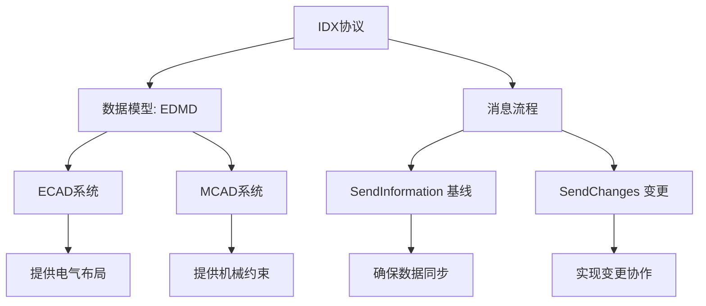

# IDX导入导出项目设计规划

## 背景知识

### IDX协议
- **全称/定义**：**集成数据交换协议**（一种基于XML的标准数据格式与通信协议）
- **核心目的**：实现**ECAD与MCAD系统间**双向、无损的PCB设计数据协作
- **协议构成**：
  - **XSD模式**：定义数据结构（`EDMDSchema.*.xsd`）
  - **WSDL接口**：定义通信服务（可选的Web服务描述）
  - **实施指南**：解释如何建模、如何使用消息
- **关键特性**：
  - 支持**基线同步**（`SendInformation`）
  - 支持**变更提议与响应**（`SendChanges`）
  - 支持**2.5D几何**与**外部3D模型引用**
  - 提供**传统**与**简化**（v4.0+ `geometryType`）两种建模方式

### ECAD
- **全称/定义**：**电子计算机辅助设计**（Electronic Computer-Aided Design）
- **领域**：**电气/电子设计**
- **在设计中的角色**：
  - 创建电路原理图、PCB布局、布线
  - 定义电气规则、信号完整性、电源分布
- **在IDX协作中的角色**：
  - 提供**板轮廓**、**元件布局**、**布线**、**过孔**、**禁布区**等电气设计数据
  - 发送初始**基线**（`SendInformation`）
  - 提议或响应**布局变更**（`SendChanges`）
- **典型输出**：Gerber、ODB++、IPC-2581及**IDX文件**

### MCAD
- **全称/定义**：**机械计算机辅助设计**（Mechanical Computer-Aided Design）
- **领域**：**机械/结构设计**
- **在设计中的角色**：
  - 设计产品外壳、支架、散热器
  - 执行结构分析、热仿真、装配检查
- **在IDX协作中的角色**：
  - 提供**安装孔**、**禁布区**（因机械干涉）、**板弯曲区域**等机械约束
  - 检查**元件碰撞**、**散热间隙**、**装配可行性**
  - 接受或拒绝ECAD的变更提议，并反馈机械修改建议
- **典型输出**：STEP、STL、SolidWorks、CATIA文件及**IDX文件**

### EDMD
- **全称/定义**：**电子设计机械设计**（Electronic Design Mechanical Design）
- **本质**：IDX协议的**核心数据模型命名空间**与**XML根元素**
- **关键组成**：
  - **`EDMDDataSet`**：IDX消息的根容器（包含Header、Body、ProcessInstruction）
  - **`EDMDItem`**：所有可协作对象（板、元件、孔、禁布区等）的基础类
  - **`EDMDItemInstance`**：Item在装配中的具体实例（带位置变换）
  - **`EDMDShape`**：描述几何形状的抽象类（2.5D拉伸体或外部文件引用）
- **命名空间体现**：
  - `xmlns:foundation="http://prostep.org/EDMD/5.0/foundation"`
  - `xmlns:pdm="http://prostep.org/EDMD/5.0/pdm"`
  - 所有IDX XML元素均以`EDMD`为模型基础

### 关系总结


**一句话概括**：**IDX协议** 是以 **EDMD** 数据模型为基础，在 **ECAD**（电气方）与 **MCAD**（机械方）之间实现PCB设计协作的标准化框架。

## IDX建模指南

基于官方建模指南，本项目总结编写了`IDXv4.5 建模指南.md`，作为`IDX`建模参考文档。

## 项目架构

本项目的`IDX`导入导出主要基于`ECAD`的视角，分为两个主要模块：

+ 导出模块：根据`ECAD`系统提供的数据，导出`IDX`格式源码。
+ 导入模块：根据`IDX`格式源码，提取`ECAD`系统数据。

因此，整个项目的目录结构将按如下思路设计：

```txt
idx-io/
├── src/
│   ├── core/                    # EDMD
│   │   ├── types/               # TypeScript类型定义
│   │   ├── schemas/             # XSD/JSON Schema验证
│   │   │   ├── idx-v4.5.xsd
│   │   │   └── validators.ts
│   │   ├── xml/                 # XML处理工具
│   │   │   ├── builder.ts      # XML构建器
│   │   │   ├── parser.ts       # XML解析器
│   │   │   └── utils.ts        # XML工具函数
│   │   └── utils/               # 通用工具函数
│   ├── exporter/                # 导出模块
│   │   ├── index.ts            # 主导出入口
│   │   ├── idx-exporter.ts     # IDX导出器主类
│   │   ├── builders/           # 各类构建器
│   │   │   ├── board-builder.ts    # PCB板构建
│   │   │   ├── component-builder.ts # 组件构建
│   │   │   ├── layer-builder.ts     # 层构建
│   │   │   └── change-builder.ts    # 变更构建
│   │   ├── writers/            # 各种写入器
│   │   │   ├── idx-writer.ts   # IDX文件写入
│   │   │   ├── xml-writer.ts   # XML格式写入
│   │   │   └── compression.ts  # 压缩处理
│   │   └── adapters/           # 适配器（连接外部数据源）
│   │       ├── ecad-adapter.ts # ECAD系统适配
│   │       └── generic-adapter.ts
│   ├── importer/                # 导入模块（未来）
│   └── models/                  # 业务模型
│       ├── pcb-board.ts
│       ├── component.ts
│       └── ...
├── examples/                    # 示例代码
│   ├── export-basic.ts         # 基础导出示例
│   ├── export-with-layers.ts   # 多层板示例
│   ├── export-flex-board.ts    # 柔性板示例
│   └── test-data/              # 测试数据
├── test/                       # 测试
│   ├── unit/
│   ├── integration/
│   └── fixtures/               # 测试固件
├── docs/                       # 文档
│   ├── api/                    # API文档
│   ├── usage/                  # 使用指南
│   └── protocol/               # IDX协议文档
├── scripts/                    # 构建/部署脚本
├── package.json
├── tsconfig.json
├── tsconfig.build.json         # 生产构建配置
└── README.md
```

## 技术选型

本项目采用`TypeScript`实现，使用`xmlbuilder2`进行`IDX`格式编码，使用`fast-xml-parser`进行`IDX`格式解析，支持单元测试，因此基本的`package.json`依赖如下所示：

```json
{
	"dependencies": {
		"fast-xml-parser": "^5.3.3",
		"xmlbuilder2": "^4.0.3"
	},
	"devDependencies": {
		"@types/node": "^20.0.0",
		"@typescript-eslint/eslint-plugin": "^6.0.0",
		"@typescript-eslint/parser": "^6.0.0",
		"@vitest/coverage-v8": "^1.0.0",
		"eslint": "^8.0.0",
		"eslint-config-prettier": "^9.0.0",
		"eslint-plugin-prettier": "^5.0.0",
		"prettier": "^3.0.0",
		"rimraf": "^5.0.0",
		"tsup": "^8.0.0",
		"typescript": "^5.0.0",
		"vitest": "^1.0.0"
	}
}
```

*注*：代码注释遵循文档：`TypeScript代码注释规范指南.md`。

## 导出模块设计


## 导入模块设计

计划中，暂不支持。

